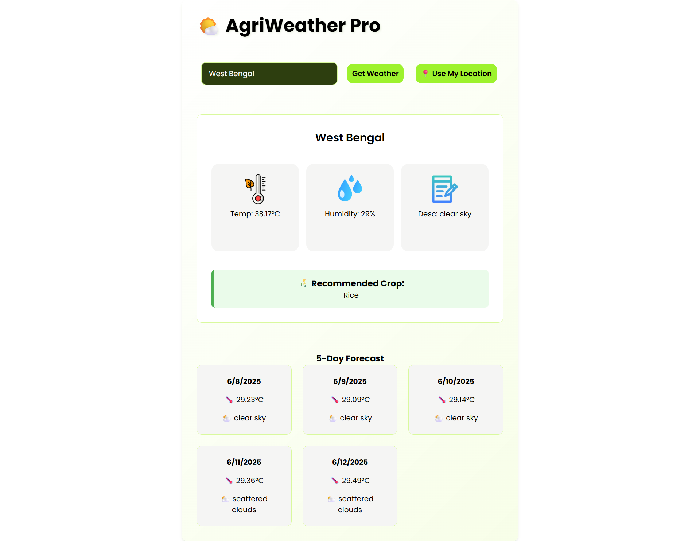

# 🌾 AgriWeather Pro – Weather Forecast & Crop Recommendation App


**AgriWeather Pro** is a smart web application that gives users real-time weather updates, 5-day forecasts, and personalized **crop recommendations** based on weather parameters (temperature & humidity). This app is ideal for **farmers, agri-tech professionals**, and **students** interested in sustainable agriculture.

---

## 🌐 Live Demo

> 🔗 [Try the app on Render](https://wheather-app-2pba.onrender.com)

---

## 🛠️ Tech Stack

### 🔹 Frontend
- **ReactJS** (Hooks-based SPA)
- CSS3 with Responsive Design
- Image Assets for better UX

### 🔹 Backend
- **Node.js** with **Express**
- **OpenWeatherMap API** for weather and forecast
- **REST API** for crop suggestions
- Hosted on **Render**

---

## ⚙️ Features

✅ Search weather by city name  
✅ Fetch weather using your current location  
✅ View temperature, humidity, and weather description  
✅ See 5-day forecast (one entry per day)  
✅ Get intelligent crop recommendations based on weather  
✅ Clean and responsive UI

---

## 📸 Screenshots
Here’s what the AgriWeather app looks like:


---

## 🧠 Crop Recommendation Logic

Based on temperature and humidity:

| Crop               | Temperature (°C) | Humidity (%) |
|--------------------|------------------|--------------|
| Rice               | 20 - 35          | 60 - 90      |
| Wheat              | 18 - 27          | 50 - 70      |
| Maize              | 22 - 35          | 50 - 80      |
| Cotton             | 24 - 35          | 40 - 60      |
| Sugarcane          | 25 - 38          | 60 - 90      |
| Barley             | 15 - 25          | 40 - 70      |
| Groundnut (Peanut) | 25 - 40          | 30 - 70      |
| Soybean            | 20 - 30          | 50 - 80      |
| Pulses             | 15 - 30          | 40 - 60      |
| Mustard            | 10 - 25          | 40 - 60      |
| Tea                | 15 - 30          | 60 - 90      |

---

## 🚀 How to Run Locally

### 🧩 Prerequisites
- Node.js & npm
- React (via `create-react-app` or Vite)
- .env file with OpenWeatherMap API key

### 🔧 Backend Setup
```bash
cd backend
npm install
touch .env
# Add your API key in .env:
# API_KEY=your_openweather_api_key

node index.js


### 🎨 Frontend Setup
cd frontend
npm install
npm start

Folder Structure
AgriWeather-Pro/
│
├── backend/
│   ├── index.js          # Express backend
│   └── .env              # API keys
│
├── frontend/
│   ├── src/
│   │   ├── App.js        # Main component
│   │   └── assets/       # Weather icons
│   └── public/
│
└── README.md

 Author
Puspendu Nayak
<p align="left">
  <a href="https://www.linkedin.com/in/puspendu-nayak/" target="_blank">
    
  </a>
  <a href="mailto:puspendu.nayak17@gmail.com" target="_blank">
    
  </a>
  <a href="https://github.com/PuspenduNayak" target="_blank">
    
  </a>
</p>
